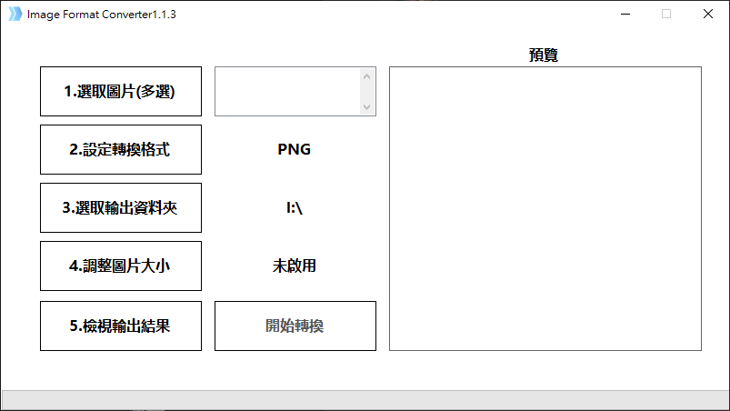

## Image-Format-Converter

Image-Format-Converter is a tool for convert image format to other format by use Magick.

## The GUI is like that:

## Support input image format:

[x] jpg
[x] jpeg
[x] bmp
[x] png
[x] heic

## Support output image format:

[x] jpg
[ ] jpeg
[x] bmp
[x] png
[ ] heic

## Support resize image
